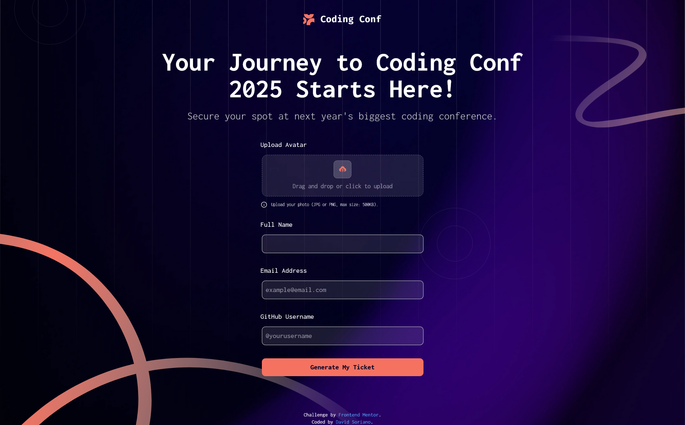
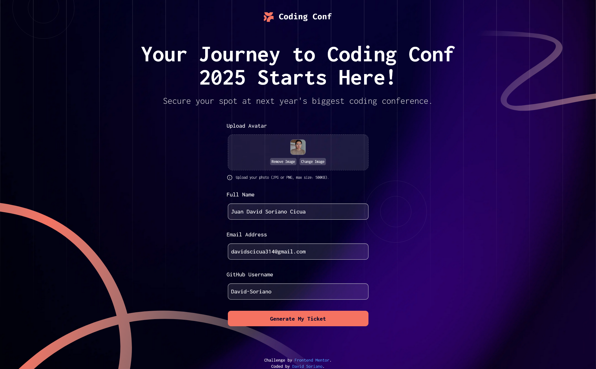
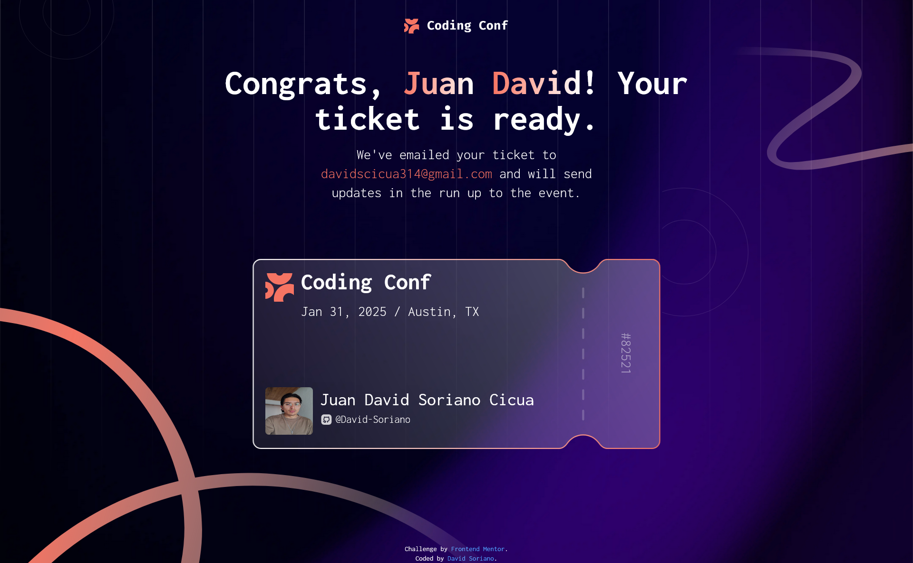
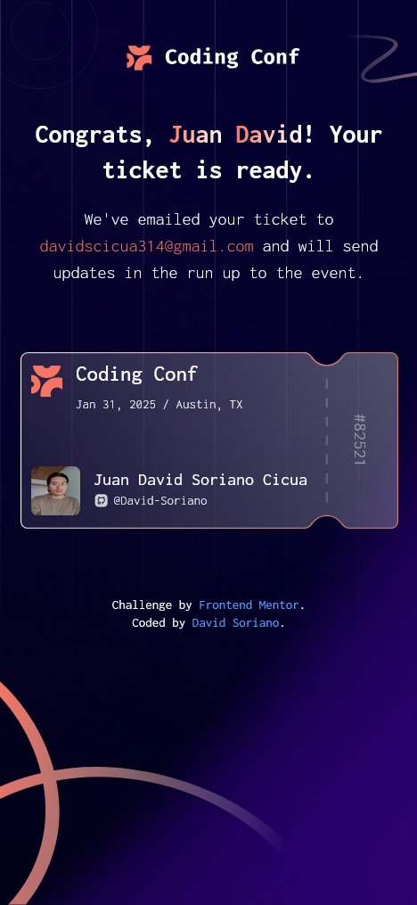

# Frontend Mentor - Conference ticket generator solution

This is a solution to the [Conference ticket generator challenge on Frontend Mentor](https://www.frontendmentor.io/challenges/conference-ticket-generator-oq5gFIU12w). Frontend Mentor challenges help you improve your coding skills by building realistic projects. 

## Table of contents

- [Overview](#overview)
  - [The challenge](#the-challenge)
  - [Screenshot](#screenshot)
  - [Links](#links)
- [My process](#my-process)
  - [Built with](#built-with)
  - [What I learned](#what-i-learned)
  - [Continued development](#continued-development)
  - [Useful resources](#useful-resources)
- [Author](#author)
- [Acknowledgments](#acknowledgments)

## Overview

### The challenge

Users should be able to:

- Complete the form with their details
- Receive form validation messages if:
  - Any field is missed
  - The email address is not formatted correctly
  - The avatar upload is too big or the wrong image format
- Complete the form only using their keyboard
- Have inputs, form field hints, and error messages announced on their screen reader
- See the generated conference ticket when they successfully submit the form
- View the optimal layout for the interface depending on their device's screen size
- See hover and focus states for all interactive elements on the page

### Screenshot
- Big screens (1440px)
  
  
  
  

- Mobile screens (375px)
  
  
  
### Links

- Solution URL: [GitGub](https://github.com/David-Soriano/Ticket_conference)
- Live Site URL: [Netlify](https://ticketconference.netlify.app/)

## My process

### Built with

- Semantic HTML5 markup
- CSS custom properties
- Flexbox
- CSS Grid
- Tailwind CSS
- Mobile-first workflow
- [React](https://reactjs.org/) - JS library

### What I learned

Creating and reusing components in React, including React Router routes
```html
import { BrowserRouter as Router, Routes, Route } from 'react-router-dom'
import './styles/index.css'
import { Header } from './components/Header/Header'
import { Init } from './pages/Init/Init'
import { Home } from './pages/Home/Home'
import { Footer } from './components/Footer/Footer'
function App() {

  return (
    <Router>
      <Header />
      <Routes>
        <Route path='/' element={<Init />} />
        <Route path='/home' element={<Home />}/>
      </Routes>
      <Footer />
    </Router>
  )
}

export default App

```
3D effects on DOM elements.
```js
   const sectionRef = useRef(null);
    const targetRotation = useRef({ x: 0, y: 0 });
    const currentRotation = useRef({ x: 0, y: 0 });
    const animationFrame = useRef(null);

    const handleMouseMove = (e) => {
        const card = sectionRef.current;
        const rect = card.getBoundingClientRect();
        const x = e.clientX - rect.left;
        const y = e.clientY - rect.top;
        const centerX = rect.width / 2;
        const centerY = rect.height / 2;

        // Guardamos la rotación objetivo
        targetRotation.current.x = ((y - centerY) / centerY) * -10;
        targetRotation.current.y = ((x - centerX) / centerX) * 10;
    };

    const handleMouseLeave = () => {
        targetRotation.current = { x: 0, y: 0 };
    };

    const animate = () => {
        // Interpolación suave (lerp)
        currentRotation.current.x += (targetRotation.current.x - currentRotation.current.x) * 0.1;
        currentRotation.current.y += (targetRotation.current.y - currentRotation.current.y) * 0.1;

        sectionRef.current.style.transform = `
            perspective(1000px)
            rotateX(${currentRotation.current.x}deg)
            rotateY(${currentRotation.current.y}deg)
        `;

        animationFrame.current = requestAnimationFrame(animate);
    };

    useEffect(() => {
        animationFrame.current = requestAnimationFrame(animate);
        return () => cancelAnimationFrame(animationFrame.current);
    }, []);
```

### Continued development

Improve the implementation of responsive design for a cleaner, more scalable architecture that doesn't require excessive adjustments when switching between screens.

### Useful resources

- [Platzi](https://platzi.com) - This helped me for XYZ reason. I really liked this pattern and will use it going forward.

## Author

- Frontend Mentor - [@David-Soriano](https://www.frontendmentor.io/profile/David-Soriano)

## Acknowledgments

Thanks to Frontend Mentors for providing these types of projects that help improve skills and learn new things, while also showcasing our talent. Thanks to the Platzi Academy for providing the foundation and quality education needed to develop these types of projects, and to other academies and educational sites that provide us with knowledge every day.
